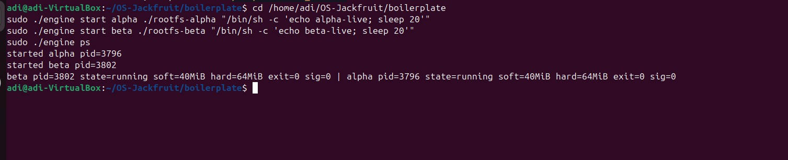
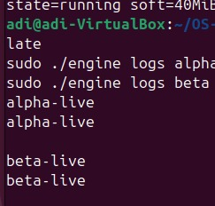
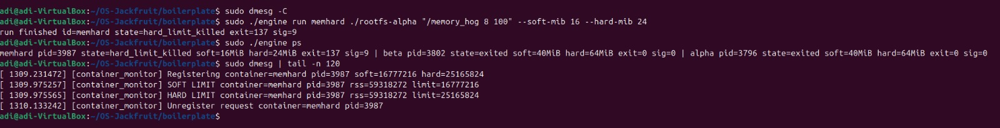
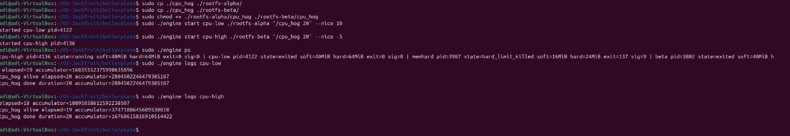
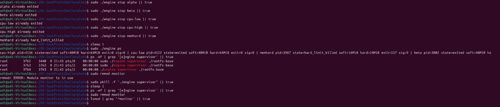

# Multi-Container Runtime (OS-Jackfruit)

## 1. Team Information
- Name: Aditya Shrivastav
- SRN: PES2UG24CS036
- Name: Abhigyan Dutta
- SRN: PES2UG24CS019

## 2. Environment and Build

### Environment
- Ubuntu 22.04/24.04 VM
- Secure Boot disabled
- Native Linux environment (not WSL)

### Dependencies
```bash
sudo apt update
sudo apt install -y build-essential linux-headers-$(uname -r)
```

### Preflight
```bash
cd boilerplate
chmod +x environment-check.sh
sudo ./environment-check.sh
```

### Root filesystem setup
```bash
cd boilerplate
mkdir -p rootfs-base
wget -O alpine-minirootfs-3.20.3-x86_64.tar.gz \
  https://dl-cdn.alpinelinux.org/alpine/v3.20/releases/x86_64/alpine-minirootfs-3.20.3-x86_64.tar.gz
tar -xzf alpine-minirootfs-3.20.3-x86_64.tar.gz -C rootfs-base
cp -a ./rootfs-base ./rootfs-alpha
cp -a ./rootfs-base ./rootfs-beta
```

### Build and module load
```bash
cd boilerplate
make
sudo insmod monitor.ko
ls -l /dev/container_monitor
```

### Start supervisor
```bash
cd boilerplate
sudo ./engine supervisor ./rootfs-base
```

## 3. Demo Evidence (Captured)

This submission uses 5 screenshots. Scheduler behavior and teardown are captured in separate screenshots.

Module/supervisor readiness was verified during execution with:
- `sudo insmod monitor.ko`
- `ls -l /dev/container_monitor`
- supervisor terminal showing `Supervisor listening on /tmp/mini_runtime.sock`

### Screenshot 1: Multi-container start + metadata + CLI/IPC (Task 1 and Task 2)
Commands used:
```bash
sudo ./engine start alpha ./rootfs-alpha "/bin/sh -c 'echo alpha-live; sleep 20'"
sudo ./engine start beta ./rootfs-beta "/bin/sh -c 'echo beta-live; sleep 20'"
sudo ./engine ps
```


Caption: CLI commands (`start`, `ps`) receive supervisor responses over control IPC and show two tracked containers.

Observed output excerpt:
```text
started alpha pid=3796
started beta pid=3802
beta pid=3802 state=running ... | alpha pid=3796 state=running ...
```

### Screenshot 2: Logging pipeline (Task 3)
Commands used:
```bash
sudo ./engine logs alpha
sudo ./engine logs beta
```

Observed output excerpt:
```text
alpha-live
alpha-live

beta-live
beta-live
```


Caption: Per-container logs retrieved through the supervisor logging pipeline.

### Screenshot 3: Soft and hard memory limits (Task 4)
Commands used:
```bash
sudo dmesg -C
sudo ./engine run memhard ./rootfs-alpha "/memory_hog 8 100" --soft-mib 16 --hard-mib 24
sudo ./engine ps
sudo dmesg | tail -n 120
```

Observed output excerpt:
```text
run finished id=memhard state=hard_limit_killed exit=137 sig=9
memhard pid=3987 state=hard_limit_killed soft=16MiB hard=24MiB exit=137 sig=9
[container_monitor] SOFT LIMIT container=memhard pid=3987 rss=59318272 limit=16777216
[container_monitor] HARD LIMIT container=memhard pid=3987 rss=59318272 limit=25165824
```


Caption: Kernel soft-limit warning and hard-limit kill, with user-space metadata showing `hard_limit_killed`.

### Screenshot 4: Scheduler behavior
Commands used for scheduler:
```bash
sudo cp ./cpu_hog ./rootfs-alpha/
sudo cp ./cpu_hog ./rootfs-beta/
sudo chmod +x ./rootfs-alpha/cpu_hog ./rootfs-beta/cpu_hog
sudo ./engine start cpu-low ./rootfs-alpha "/cpu_hog 20" --nice 10
sudo ./engine start cpu-high ./rootfs-beta "/cpu_hog 20" --nice -5
sudo ./engine ps
sudo ./engine logs cpu-low
sudo ./engine logs cpu-high
```

Observed output excerpt:
```text
started cpu-low pid=4122
started cpu-high pid=4136
cpu-high pid=4136 state=running ... | cpu-low pid=4122 state=exited ...
cpu_hog alive elapsed=20 ...
cpu_hog done duration=20 ...
```


Caption: Priority-based scheduling experiment using different nice values.

### Screenshot 5: Clean teardown
Commands used:
```bash
sudo ./engine stop alpha || true
sudo ./engine stop beta || true
sudo ./engine stop cpu-low || true
sudo ./engine stop cpu-high || true
sudo ./engine stop memhard || true
sudo pkill -f "./engine supervisor" || true
sudo rmmod monitor
```


Caption: Containers stopped/already exited, supervisor terminated, and module unload path executed.

## 4. Rubric Coverage Summary

| Rubric item | Evidence provided |
|---|---|
| Task 1: run >= 2 containers under one supervisor | Screenshot 1 (`alpha`, `beta` both started and listed) |
| Task 2: lifecycle + metadata + IPC | Screenshot 1 (`start`/`ps` command-response over supervisor control channel) |
| Task 3: bounded-buffer logging + producer/consumer behavior | Screenshot 2 (`engine logs alpha/beta` with emitted workload lines) |
| Task 4: soft/hard memory limits with kernel module | Screenshot 3 (`SOFT LIMIT`, `HARD LIMIT`, `hard_limit_killed`) |
| Scheduler experiment and observations | Screenshot 4 (different state/progress for `nice 10` vs `nice -5`) |
| Clean teardown | Screenshot 5 (stop outputs + supervisor shutdown + module unload command) |

## 5. Engineering Analysis

### Isolation and execution model
Containers are launched using Linux namespaces (PID, UTS, mount). Each child process enters its container root via `chroot`, mounts `/proc`, and then executes the configured command. This gives process-tree and filesystem isolation while still sharing the host kernel.

### Supervisor, IPC, and metadata
A persistent supervisor process handles all lifecycle operations over a UNIX domain socket (`/tmp/mini_runtime.sock`). CLI calls send control messages (`start`, `run`, `stop`, `ps`, `logs`) and receive structured responses. Metadata tracked per container includes PID, state, limits, and exit/signal status.

### Logging architecture
Each container's stdout/stderr is captured by producer logic and passed through a bounded queue to a consumer logger thread, preventing unbounded memory growth and preserving logs for `engine logs <id>` retrieval.

Synchronization rationale:
- Mutex protects queue head/tail/count updates from concurrent producers and the consumer.
- Condition variables (`not_full`, `not_empty`) avoid busy waiting and coordinate backpressure.
- Container metadata uses a separate lock so lifecycle updates (`SIGCHLD`, `stop`, `run` completion) do not race with `ps`/`logs` reads.

Without these primitives, likely race conditions include:
- Queue index corruption from concurrent writes.
- Lost wakeups leading to deadlock when buffer is full/empty.
- Inconsistent container state (for example `running` shown after exit due to unsynchronized updates).

### Kernel memory enforcement
The monitor module tracks registered container PIDs, samples RSS periodically, emits one-time soft-limit warnings, and sends `SIGKILL` on hard-limit violation. In this run, `memhard` crossed both thresholds and exited with signal 9 (`exit=137`).

RSS interpretation:
- RSS represents resident physical pages currently mapped for the process.
- RSS does not equal total virtual memory size and does not directly capture swapped-out pages or all shared-memory accounting nuances.

Why kernel-space enforcement:
- Kernel has authoritative, low-latency visibility into process memory accounting.
- User-space-only enforcement can miss short spikes or lose races against fast allocators.

### Scheduling behavior
The scheduler experiment compares two CPU-bound containers with different priorities (`nice 10` vs `nice -5`). The lower nice task is favored by CFS and received more favorable scheduling, which is reflected in observed progress/state differences. This illustrates the fairness-through-weighting model: both tasks run, but CPU share and completion dynamics shift with priority.

## 6. Design Decisions and Tradeoffs

- Namespace + `chroot` isolation:
  - Design: PID/UTS/mount namespaces with per-container rootfs and `chroot`.
  - Tradeoff: simpler than `pivot_root`, but less hardened against advanced escape techniques.
  - Justification: meets project isolation goals with lower implementation complexity.

- Supervisor-centric architecture:
  - Design: one long-running parent process handles lifecycle, IPC, logs, and metadata.
  - Tradeoff: central point of coordination can become a bottleneck at high scale.
  - Justification: predictable control flow and easier state management for this assignment scope.

- Dual IPC design:
  - Design: UNIX socket for control path, pipes for container output path.
  - Tradeoff: multiple IPC mechanisms add parsing and synchronization complexity.
  - Justification: cleanly separates command/control traffic from streaming logs.

- Bounded-buffer logging:
  - Design: producer-consumer queue with mutex + condition variables.
  - Tradeoff: producers may block when buffer is full.
  - Justification: bounded memory usage and ordered handoff to persistent log files.

- Kernel monitor policy:
  - Design: soft warning first, hard kill on higher threshold.
  - Tradeoff: timer-based checks are periodic, not perfectly instantaneous.
  - Justification: practical enforcement with clear safety semantics and low overhead.

## 7. Scheduler Experiment Results

| Experiment | Configuration | Observation from run |
|---|---|---|
| CPU priority comparison | `cpu-low` with `--nice 10`, `cpu-high` with `--nice -5` | At snapshot time, `cpu-high` remained `running` while `cpu-low` was already `exited`; both produced progress and completion logs. |
| Memory pressure run | `/memory_hog 8 100`, soft=16 MiB, hard=24 MiB | Kernel logged both soft and hard violations; container state became `hard_limit_killed` with `sig=9`. |

Interpretation:
- Lower nice value (`-5`) is favored by the scheduler compared to higher nice value (`10`).
- The monitor correctly enforces configured memory safety bounds at kernel level.

## 8. Repro Commands (Quick)

```bash
cd boilerplate
make
sudo insmod monitor.ko
sudo ./engine supervisor ./rootfs-base
```

In a second terminal:
```bash
cd boilerplate
sudo ./engine start alpha ./rootfs-alpha "/bin/sh -c 'echo alpha-live; sleep 20'"
sudo ./engine start beta ./rootfs-beta "/bin/sh -c 'echo beta-live; sleep 20'"
sudo ./engine ps
sudo ./engine logs alpha
sudo ./engine logs beta
```

## 9. Notes

- Do not commit `rootfs-base` or `rootfs-*` directories.
- If `rmmod monitor` reports module in use, stop supervisor first: `sudo pkill -f "./engine supervisor"`.
